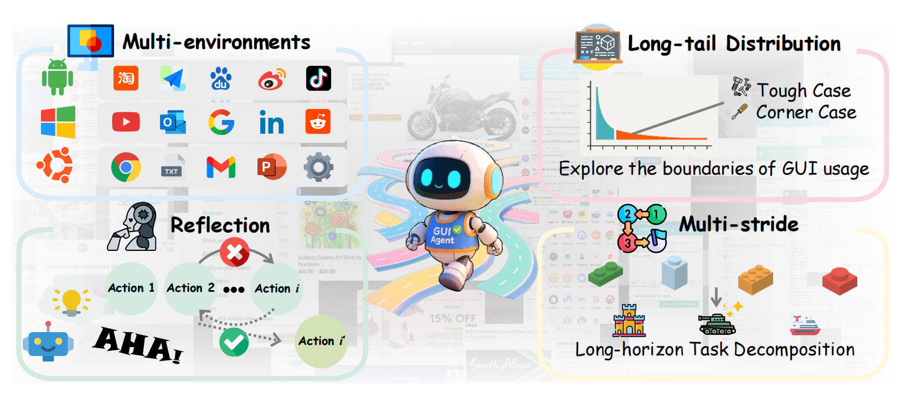
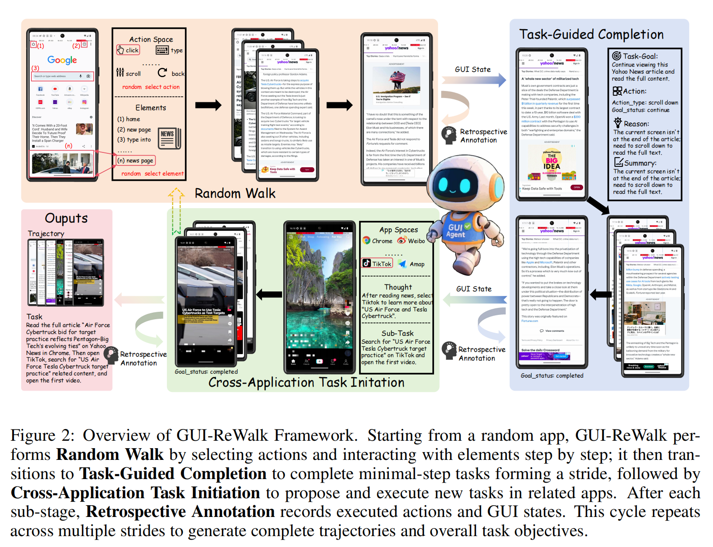
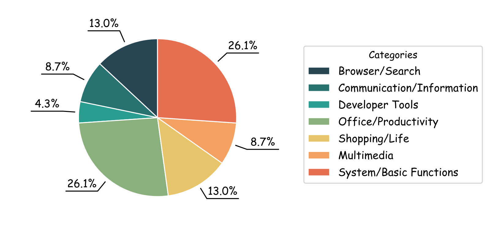

# GUI-ReWalk

<p align="center">
  
</p>

Graphical User Interface (GUI) Agents, powered by large language and vision-language models, hold promise for enabling end-to-end automation in digital environments. However, their progress is fundamentally constrained by the scarcity of scalable, high-quality trajectory data. Existing data collection strategies either rely on costly and inconsistent manual annotations or on synthetic generation methods that trade off between diversity and meaningful task coverage. To bridge this gap, we present **GUI-ReWalk**—a reasoning-enhanced, multi-stage framework for synthesizing realistic and diverse GUI trajectories. GUI-ReWalk begins with a stochastic exploration phase that emulates human trial-and-error behaviors, and progressively transitions into a reasoning-guided phase where inferred goals drive coherent and purposeful interactions. Moreover, it supports multi-stride task generation, enabling the construction of long-horizon workflows across multiple applications. By combining randomness for diversity with goal-aware reasoning for structure, GUI-ReWalk produces data that better reflects the intent-aware, adaptive nature of human-computer interaction. We further train GUI-ReWalk-7B on the our dataset and evaluate it across multiple benchmarks, including Screenspot-Pro, OSWorld-G, UI-Vision, AndroidControl, and GUI-Odyssey. Results demonstrate that GUI-ReWalk enables superior coverage of diverse interaction flows, higher trajectory entropy, and more realistic user intent. These findings establish GUI-ReWalk as a scalable and data-efficient framework for advancing GUI agent research and enabling robust real-world automation.

---

## 🚀 Highlights

- **Human-like GUI Modeling** We formalize GUI trajectories as a hierarchical Markov Decision Process, where each stride combines subgoal abstraction with stride-based reasoning to capture both exploratory and goal-directed behaviors.  


- **The GUI-ReWalk framework**: We introduce a multi-stage framework integrating random exploration, task-guided completion, and cross-application task initiation, enhanced by retrospective LLM-based annotation and error-recovery mechanisms that mirror real human interaction patterns.

- **Dataset analysis and model evaluation**: We provide an in-depth analysis of the GUI-ReWalk dataset and demonstrate its effectiveness by training GUI-ReWalk-7B, which achieves substantial improvements across grounding and navigation benchmarks.

---

## 📊 Framework Overview

  

---

## 📂 Dataset Characteristics

- Multi-platform coverage: **Mobile + Desktop**
- Long-tail distribution with rare but meaningful corner cases
- Reflective annotations and multi-stride trajectories
- Extensive analysis on **token cost** and **scalability**

  
*Figure: Distribution of dataset domains and interaction patterns.*  

---

## 🔧 Installation

```bash
git clone https://github.com/your-username/gui-rewalk.git
pip install -r requirements.txt
```

---

## 📋 Tutorial

### 1. Download VMware-Fusion

Install VMware Workstation Pro (for systems with Apple Chips, you should install VMware Fusion) and configure the vmrun command. The installation process can refer to How to install VMware Workstation Pro. Verify the successful installation and check the path to vm by running the following:

```bash
vmrun -T ws list
```

### 2. Prepare Environment

#### 2.1 Install OSWorld

```bash
# Clone the GUI-ReWalk repository
git clone https://github.com/bytedance/GUI-ReWalk

# Change directory into the cloned repository
cd GUI-ReWalk

# Clone the OSWorld repository
git clone https://github.com/xlang-ai/OSWorld.git
cd OSWorld

# Optional: Create a Conda environment for GUI-ReWalk
conda create -n rewalk python=3.10
conda activate rewalk

# Install required dependencies of osworld first
pip install -r requirements.txt
pip install desktop-env
pip install -e .
```


Test OSWorld with the following script (this will automatically download an Ubuntu image and open it in VMware; you may need to grant some permissions to VMware):

```python
from OSWorld.desktop_env.desktop_env import DesktopEnv

example = {
    "id": "94d95f96-9699-4208-98ba-3c3119edf9c2",
    "instruction": "I want to install Spotify on my current system. Could you please help me?",
    "config": [
        {
            "type": "execute",
            "parameters": {
                "command": [
                    "python",
                    "-c",
                    "import pyautogui; import time; pyautogui.click(960, 540); time.sleep(0.5);"
                ]
            }
        }
    ],
    "evaluator": {
        "func": "check_include_exclude",
        "result": {
            "type": "vm_command_line",
            "command": "which spotify"
        },
        "expected": {
            "type": "rule",
            "rules": {
                "include": ["spotify"],
                "exclude": ["not found"]
            }
        }
    }
}

env = DesktopEnv(action_space="pyautogui")

obs = env.reset(task_config=example)
obs, reward, done, info = env.step("pyautogui.rightClick()")
```

#### 2.2 Install OmniParser

```bash
git clone https://github.com/microsoft/OmniParser.git
cd OmniParser

# Download the model checkpoints to local directory OmniParser/weights/
for f in icon_detect/{train_args.yaml,model.pt,model.yaml} icon_caption/{config.json,generation_config.json,model.safetensors}; do huggingface-cli download microsoft/OmniParser-v2.0 "$f" --local-dir weights; done
mv weights/icon_caption weights/icon_caption_florence
```

### 3. Run GUI-ReWalk

#### 3.1 Run bash script to start a trace generating task

```bash
bash run_random_walker.sh
```

#### 3.2 Parameter Explanation

The following are explanations of the key parameters in the `run_rewalk.sh` script:

| Parameter | Description |
|-----------|-------------|
| `--task_num` | Number of tasks to generate |
| `--vm_provider` | Virtual machine provider, e.g., "vmware" |
| `--path_to_vm` | Path to the virtual machine configuration file |
| `--observation_type` | Type of observation to use, e.g., "screenshot" |
| `--action_space` | Action space to use, e.g., "gen_data" |
| `--model` | Model to use for generation, e.g., "doubao" |
| `--model_version` | Specific version of the model to use |
| `--exce_task_completion` | Whether to execute task completion phase |
| `--reverse_inference` | Whether to perform reverse inference |
| `--summary_inference` | Whether to perform summary inference |
| `--max_random_actions` | Maximum number of random actions to perform |
| `--max_guided_actions` | Maximum number of guided actions to perform |
| `--random_walk_cross_app` | Whether to perform random walk across applications |
| `--max_guided_actions_after_openapp` | Maximum guided actions after opening an app |
| `--max_trajectory_length` | Maximum length of generated trajectory |
| `--score_threshold` | Score threshold for task quality |
| `--pq_format` | Format for saving the generated data |
| `--ocr_model_path` | Path to the OCR model for screen analysis |
| `--random_walker` | Whether to enable random walker |
| `--enable_thinking` | Whether to enable thinking process in generation |
| `--use_ark` | Whether to use ARK API for model inference |
| `--result_dir` | Directory to save the results |

Environment variables in the script:

- `PYTHONPATH`: Sets the Python path to include the GUI-ReWalk repository
- `API_KEY`: API key for accessing the language model service
- `API_BASE_URL`: Base URL for the language model API

## 📚 CITE

```
@misc{lin2025guirewalkmassivedatageneration,
       title={GUI-ReWalk: Massive Data Generation for GUI Agent via Stochastic Exploration and Intent-Aware Reasoning},
       author={Musen Lin and Minghao Liu and Taoran Lu and Lichen Yuan and Yiwei Liu and Haonan Xu and Yu Miao and Yuhao Chao and Zhaojian Li},
       year={2025},
       eprint={2509.15738},
       archivePrefix={arXiv},
       primaryClass={cs.LG},
       url={https://arxiv.org/abs/2509.15738},
}
```
